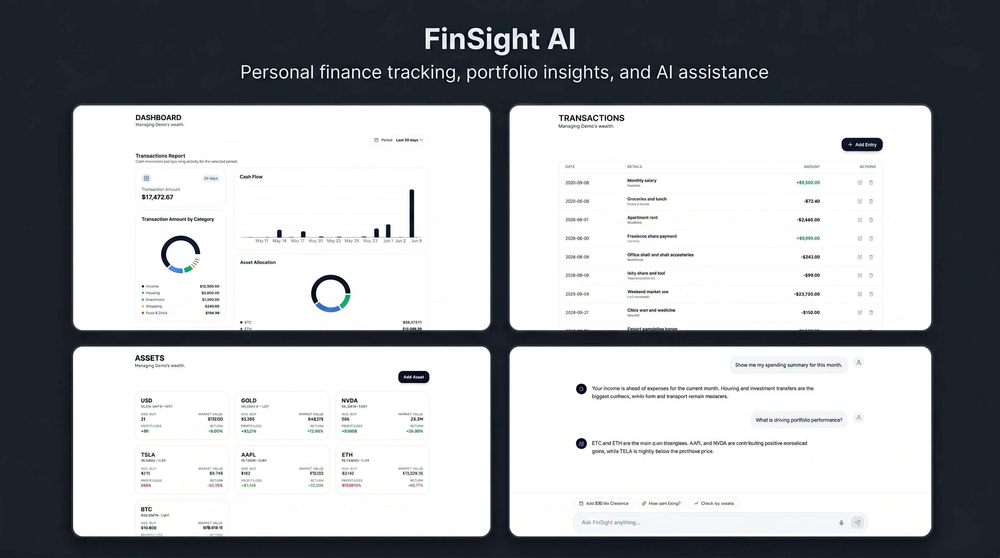

# FinSight AI



FinSight AI is a personal finance monorepo with a NestJS backend and a React/Vite frontend. It helps you track transactions, monitor assets, follow currency rates, and get AI-assisted guidance from the same application.

## Current Features

- Secure account registration, login, profile access, and profile updates
- Transaction management with create, list, update, and delete support
- Asset tracking with grouped holdings, purchase prices, market value, and profit/loss views
- Dashboard reporting with selectable time ranges, cash flow charts, category breakdowns, and portfolio allocation charts
- AI-generated finance insights based on your transactions and assets
- Chat assistant backed by Socket.IO for interactive finance questions and commands
- Currency data and exchange-rate management, including CoinGecko-backed rate sync support
- Role-protected admin endpoints for currency rate updates

## Stack

- Backend: NestJS, TypeORM, PostgreSQL, JWT, Passport, Socket.IO, Google Gemini, CoinGecko
- Frontend: React 19, Vite, TypeScript, Tailwind CSS, Axios, React Router, Recharts, Socket.IO client

## Repository Layout

- `finsight-api/`: API, auth, finance, assets, transactions, AI, migrations
- `finsight-web/`: Client app, dashboard, insights, assistant, settings, auth UI
- `docs/`: implementation notes and deployment checklists

## Local Setup

1. Prepare the database:
   ```bash
   docker compose up
   ```

2. Install and configure the backend:
   ```bash
   cd finsight-api
   yarn install
   cp .env.example .env
   yarn run start:dev
   ```

3. Install and configure the frontend:
   ```bash
   cd finsight-web
   npm install
   cp .env.example .env
   npm run dev
   ```

4. Point `VITE_API_URL` at the backend, usually `http://localhost:4000`.

## Docker Compose

`docker compose up` starts PostgreSQL only. The API and web app still run from their own directories.

```bash
docker compose up
```

This starts:

- PostgreSQL on `localhost:5432`

Use the normal local commands for the apps:

- API: `cd finsight-api && yarn run start:dev`
- Web: `cd finsight-web && npm run dev`

If you want to override the Postgres defaults, copy [.env.example](./.env.example) to [.env](./.env) and adjust the values there.

## Demo Login

The backend includes a demo seed migration so the deployed app can show real dashboard data without manual setup.

Use this account after the migrations run:

- Email: `demo@finsight.ai`
- Password: `password123`

For local development or deployment, make sure the API runs with migrations enabled. `DB_RUN_MIGRATIONS=true` will apply the schema and the demo seed at startup.

The demo data is intended for screenshots and previews, including the deployed app at `https://finsight-ai-ten-sage.vercel.app/`.

## Package Commands

### Backend

```bash
cd finsight-api
yarn run start
yarn run start:dev
yarn run start:prod
yarn run test
yarn run test:e2e
yarn run test:cov
yarn run migration:run
yarn run migration:revert
```

### Frontend

```bash
cd finsight-web
npm run dev
npm run build
npm run preview
npm run lint
```

## Environment

### Backend variables

- `DB_HOST`
- `DB_PORT`
- `DB_USERNAME`
- `DB_PASSWORD`
- `DB_DATABASE`
- `DB_RUN_MIGRATIONS`
- `JWT_SECRET`
- `JWT_EXPIRATION`
- `GEMINI_API_KEY`
- `GEMINI_MODEL_ID`
- `COINGECKO_API_URL`
- `COINGECKO_API_KEY`
- `COINGECKO_API_KEY_HEADER`
- `PORT`

### Frontend variables

- `VITE_API_URL`

## Security Notes

- Never commit `.env` files, API keys, passwords, tokens, or exported personal data.
- If a secret was ever committed, rotate it first and then remove it from history before publishing the repository.
- Use `finsight-api/.env.example` and `finsight-web/.env.example` as the source of truth for local configuration.

## Contribution

- Read [CONTRIBUTING.md](./CONTRIBUTING.md) before opening a pull request.
- Follow the project code of conduct in [CODE_OF_CONDUCT.md](./CODE_OF_CONDUCT.md).
- Report security issues through the process in [SECURITY.md](./SECURITY.md).

## License

Released under the MIT License. See [LICENSE](./LICENSE).
